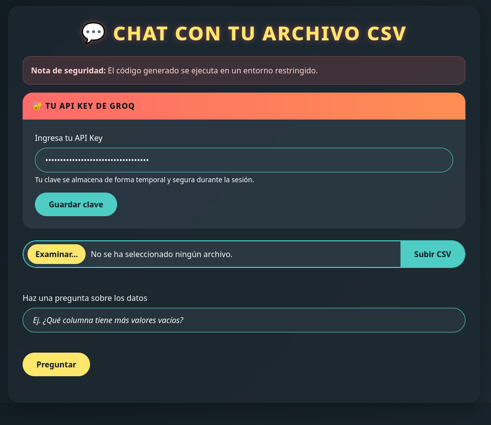

# Chatbot de Análisis de Datos con CSV

Este repositorio contiene la segunda versión, optimizada y corregida con IA, de la materia Extracción de Conocimientos en Bases de Datos, donde se desarrolló una aplicación web con Flask que permite al usuario subir un archivo CSV y hacer preguntas directamente sobre sus datos, utilizando inteligencia artificial (Groq + DeepSeek) para interpretar las preguntas y generar código ejecutable en Python (Pandas).

## Equipo de desarrollo

* Janneth Santos Molina
* Patricio de Jesús Vargas Ramírez

## Instalación

Una vez clonado el repositorio, ejecuta la siguiente instrucción:

```
# Instalación de dependencias
pip install -r requirements.txt
```

Con las dependencias instaladas, inicia la aplicación con:

```
python app.py
```

Después de esto, puedes acceder a la aplicación desde tu navegador en: *http://localhost:5000*

Puedes usar el archivo datos_ejemplos_pokemon.csv ubicado en la raíz del proyecto para realizar pruebas con el sistema de preguntas.

### Capturas de pantalla

1. Subida de archivo CSV e ingreso de preguntas

2. Visualización del código generado por IA

### Estructura del proyecto

```
├── app.py                         # Archivo principal que contiene la lógica en Flask
├── datos_ejemplo_pokemon.csv
├── requirements.txt               # Dependencias del proyecto
├── static
│   └── styles.css                 # Estilos personalizados (opcional)
├── templates
│   └── index.html                 # Plantilla HTML de la aplicación
├── uploads                        # Carpeta donde se almacenan los archivos cargados
│   └── empleados_200.csv          # Archivo de ejemplo para pruebas
├── prueba_funcionamiento
│   ├── prueba_1.png               # Capturas de funcionamiento
│   ├── prueba_2.png
│   ├── prueba_3.png
├── README.md
```

### Tecnologías utilizadas

* Flask para la aplicación web.
* Pandas para el análisis de datos.
* Groq API como proveedor de modelo.
* DeepSeek R1 Distill Llama 70B como modelo de lenguaje para interpretar preguntas.
* Bootstrap para diseño web básico (no basado en ningún tema externo).

## Comandos para Docker

 ```
 docker build -t flask-groq-app .
 ```

 ```
 docker run -p 5000:5000 --env-file .env flask-groq-app
 ```
